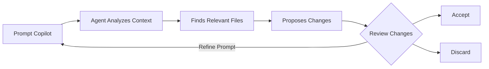

## Step 3: Getting work done even _faster_ with Copilot Agent Mode

> [!NOTE]
> **Edit Mode Deprecation:** GitHub Copilot Edit Mode has been deprecated. As a workaround, we'll use **Agent Mode** instead, which provides even more powerful capabilities for making changes across multiple files.

In our previous steps, we used features of Copilot that require more hands-on guidance and they produced mostly localized results. Now, we will explore Copilot **Agent Mode**, a feature that allows working more holistically on our repo.

### 📖 Theory: Copilot Agent Mode

Copilot **Agent Mode** lets you apply **natural‑language** driven changes across **multiple files** with autonomous capabilities.

Agent Mode is best used for **well defined** tasks where you want Copilot to autonomously determine the scope of needed changes and even run tests or commands.

#### How Agent Mode works



1. **Prompt Copilot**: Use natural language to describe the required changes.
1. **Agent Analyzes**: Copilot autonomously explores your codebase to understand context.
1. **Finds Files**: Agent determines which files need to be modified.
1. **Review Changes**: See proposed changes in-place in your code.
1. **Accept or Discard**: Review each suggested edit and choose which to keep.
1. **Iterate**: If needed, provide follow-up instructions to refine the changes.

### :keyboard: Activity: Use Copilot to add a new feature! :rocket:

Our website lists activities, but it's keeping the guest list secret 🤫

Let's use Copilot to change the website to display signed up students under each activity!

1. At the bottom of Copilot Chat window, use the dropdown to switch to **Agent** mode.

   

1. Open the files related to our webpage then drag each editor window (or file) to the chat panel, informing Copilot to use them as context.

   - `src/static/app.js`
   - `src/static/index.html`
   - `src/static/styles.css`

   

1. Ask Copilot to update our project to display the current participants of activities. Agent mode will autonomously find and update the relevant files.

   > 
   >
   > ```prompt
   > #codebase Please edit the activity cards to add a participants section.
   > It will show what participants that are already signed up for that activity as a bulleted list.
   > Remember to make it pretty!
   > ```

   > 💡 **Tip:** The `#codebase` tool helps Agent mode find the relevant files to modify. You can also provide additional context by mentioning specific files or using other tools.

   - Agent mode will analyze your codebase and determine which files need changes.
   - An extra icon has appeared next to the file names and open editor windows indicating they have suggested edits.
   - A suggested edits panel has appeared in the bottom right of the editor window providing controls to jump to the recommended changes.

      

      

1. Before we simply accept the changes, please check our website again and verify everything is updated as expected. Here is an example of an updated activity card. You may need to restart the app or refresh the page.

   

   > 🪧 **Note:** Your activity card may look different. Copilot won't always produce the same results.

   <details>
   <summary>Need help? 🤷</summary><br/>
   If the website is not loading, here are some things to check.

   - Restart the VS Code Debugger to make sure the latest version of the website is served.
   - If you forgot the url, or closed the window, please review step 1.
   - Try hard refreshing the webpage or opening in a private window so it downloads a fresh copy.

   </details>

1. Now that we have confirmed our changes are good, use the panel to cycle through each suggested edit and press **Keep** to apply the change.

   > 💡 **Tip:** You can accept the changes directly, modify them, or provide additional instruction to refine them using the chat interface.

1. With our new feature complete, please **commit** and **push** the changes to GitHub.

1. Wait a moment for Mona to check your work, provide feedback, and share the next lesson.

<details>
<summary>Having trouble? 🤷</summary><br/>

If you don't get feedback, here are some things to check:

- Make sure your commit the changes in the `src/static/` directory to the branch `accelerate-with-copilot` and pushed/synchronized to GitHub.
- If Mona found a mistake, simply make a correction and push your changes again. Mona will check your work as many times as needed.

</details>
